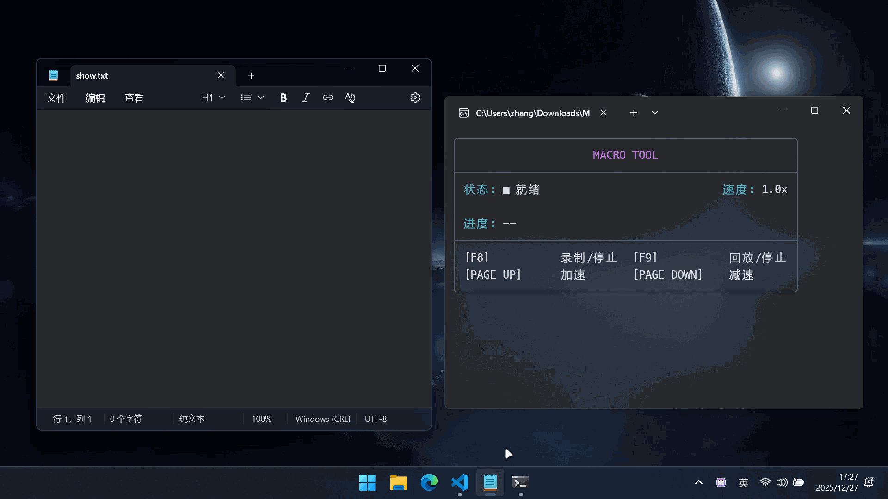

<div align="center">
  

# Macro Tool

**Lightweight Python Macro Recorder & Player**

Records mouse move/click/scroll and keyboard keys, with variable-speed looping playback.

[中文版](README.md) | [English](README_EN.md)

[](https://www.python.org/)
[](LICENSE)
[]()

  <br/>
  
  
</div>

## ✨ Features

| Feature                  | Description                                                     |
| :----------------------- | :-------------------------------------------------------------- |
| 🖱️ **Full Recording**    | Record mouse path, clicks, scroll, and keyboard keys.           |
| 🔄 **Loop Playback**     | Loop playback indefinitely until you stop it manually.          |
| ⏩ **Speed Control**     | Live speed control (speed up/down), min 0.1x.                   |
| 🎨 **Colorful UI**       | ANSI-colored terminal UI for clear status indication.           |
| ⌨️ **Global Hotkeys**    | Control recording/playback globally without switching windows.  |
| 🛠️ **Customizable**      | Customizable theme colors, hotkeys, and defaults.               |
| 💾 **Persistent Config** | Settings are saved in `settings.json` and persist across runs.  |
| 🌐 **Multi-language**    | Supports multiple languages (en, zh, es, fr, ja, ko, ru, etc.). |
| 🖥️ **DPI Awareness**     | High DPI awareness on Windows for accurate coordinates.         |

## 🚀 Quick Start

### 📦 Binaries

Grab executables from [Releases](../../releases). No Python required.

-   **Windows**: `MacroTool-Windows.exe`
-   **Linux**: `MacroTool-Linux`
-   **macOS**: `MacroTool-macOS`

> On first run (no `settings.json`), you will be prompted to choose a language.

### 🐍 Run from Source

You need a Python 3.x environment.

1.  **Install dependencies**

    ```bash
    pip install -r requirements.txt
    ```

2.  **Run the app**

    ```bash
    python src/main.py
    ```

3.  **Default Hotkeys**

    | Action        | Hotkey      | Description                      |
    | :------------ | :---------- | :------------------------------- |
    | **Record**    | `F8`        | Start / Stop Recording           |
    | **Play**      | `F9`        | Start / Stop Playback            |
    | **Speed Up**  | `Page Up`   | Increase speed (+0.5x)           |
    | **Slow Down** | `Page Down` | Decrease speed (-0.5x, min 0.1x) |

## ⚙️ Configuration

The `settings.json` file is auto-created on first run. You can edit it to customize the tool.

```json
{
    "hotkeys": {
        "record": "f8",
        "play": "f9",
        "speed_up": "page up",
        "speed_down": "page down"
    },
    "default_speed": 1.0,
    "macro_filename": "macro.json",
    "sample_rate": 0.016,
    "language": "zh",
    "theme": {
        "title": "BRIGHT_MAGENTA",
        "border": "BRIGHT_BLACK",
        "label": "CYAN",
        "status_recording": "BRIGHT_RED",
        "status_playing": "BRIGHT_GREEN",
        "progress_bar": "BRIGHT_GREEN",
        "guide_title": "BRIGHT_YELLOW"
    }
}
```

### Field Notes

-   **`hotkeys`**: Hotkeys for record, play, speed up, and speed down.
-   **`default_speed`**: Default playback speed multiplier.
-   **`macro_filename`**: Filename for saving recorded macros.
-   **`sample_rate`**: Recording interval in seconds (default `0.016` ~60Hz).
-   **`language`**: Language code (`zh`, `en`, `es`, `fr`, `ja`, `ko`, `zh-TW`, `ru`).
-   **`theme`**: Terminal colors (`BRIGHT_*`, base colors, `BOLD`, `ENDC`).

## ⚠️ Notes

-   **Data Storage**: Recorded data defaults to `macro.json` in the current directory.
-   **Mouse Control**: During playback, the mouse is controlled by the script. Press the **Play Hotkey** (F9) to stop.
-   **Permissions**: Some high-privilege contexts (like games or admin windows) may require running the terminal as **Administrator**.

## 📝 License

[MIT License](./LICENSE)
